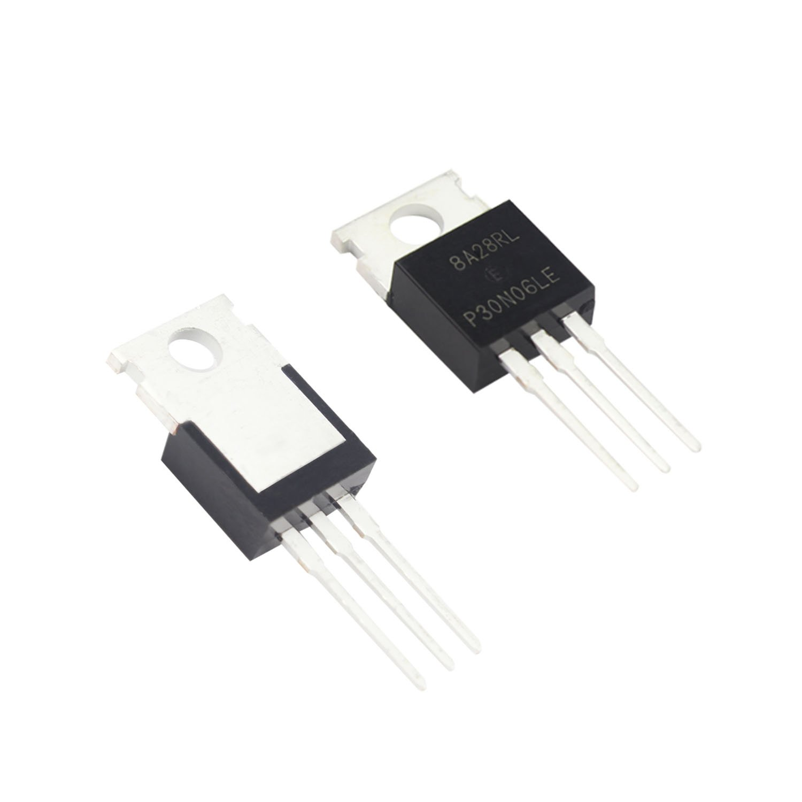

<h1 align="center">LED Walkway</h1>

    

<h2>Table of contents</h2>

  <ul>
    <li><a href="https://github.com/MrDemeanor/led-walkway#overview">Overview</a></li>
        <ul>
            <li><a href="https://github.com/MrDemeanor/led-walkway#parts-list">Parts List</a></li>
        </ul>
    <li><a href="https://github.com/MrDemeanor/led-walkway#getting-started">Getting Started</a></li>
  </ul>

<h2>Overview</h2>

  Utilizing an Arduino Uno and some basic electronics, we can control the brightness of a series of LED strips based on if someone is standing in front of the strip. 

<h3>Parts List</h3>

<ul>
    <li><a href="https://www.amazon.com/gp/product/B08P1H3LG9/ref=ppx_yo_dt_b_asin_title_o00_s00?ie=UTF8&psc=1">5v LED Fairy Lights</a></li>
    <li><a href="https://www.amazon.com/gp/product/B06XK3X3PW/ref=ppx_yo_dt_b_asin_title_o00_s00?ie=UTF8&psc=1">5v 60A 300W Power Supply</a></li>
    <li><a href="https://www.amazon.com/gp/product/B07CTF1JVD/ref=ppx_yo_dt_b_asin_title_o00_s00?ie=UTF8&psc=1">N-Channel Mosfet TO-220</a></li>
    <li><a href="https://www.amazon.com/gp/product/B072L1XMJR/ref=ppx_od_dt_b_asin_title_s00?ie=UTF8&psc=1">Jumper Wires</a></li>
    <li><a href="https://www.amazon.com/gp/product/B01JG09DCK/ref=ppx_od_dt_b_asin_title_s00?ie=UTF8&psc=1">HC-SR04 Ultrasonic Distance Sensor</a></li>
</ul>

<h2>Getting Started</h2>

    Get 4 HC-SR04 Ultrasonic Distance Sensors and connect them to the Arduino Uno according to the following schematic: 

    Now take one of your mosfets, and connect the <strong>gate</strong> pin (the leftmost pin, refer to the right mosfet below) to pin 10 on the Arduino. Take three more mosfets and do the same for pins 11, 12 and 13.

  This is a PlatformIO project. Ensure that you first have VS Code installed, and then download the PlatformIO extension. 

    Build the project by clicking the checkmark at the bottom left-hand corner of VS code. When you're ready to upload your sketch, click the button that looks like an arrow pointing to the right. 

